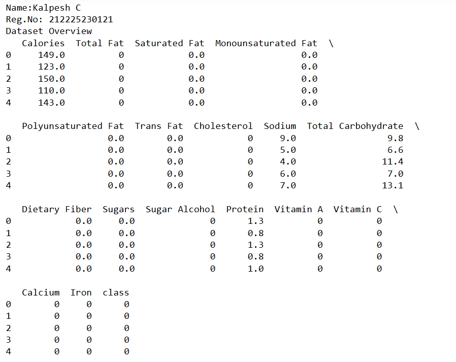
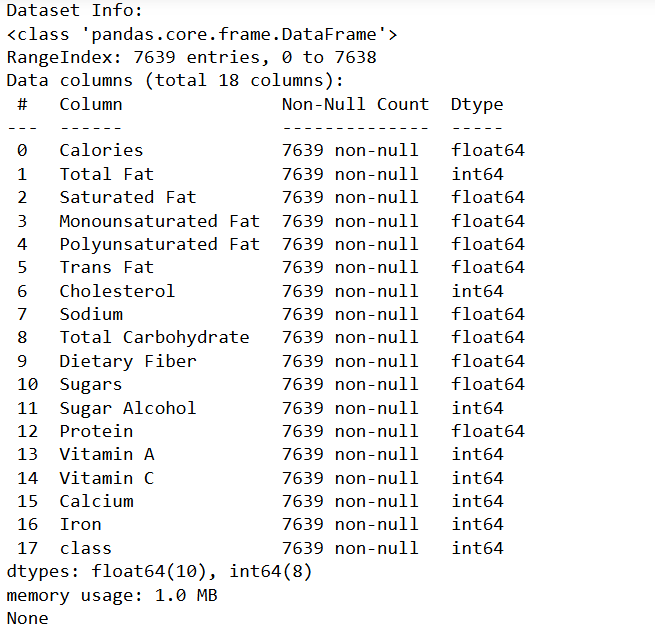
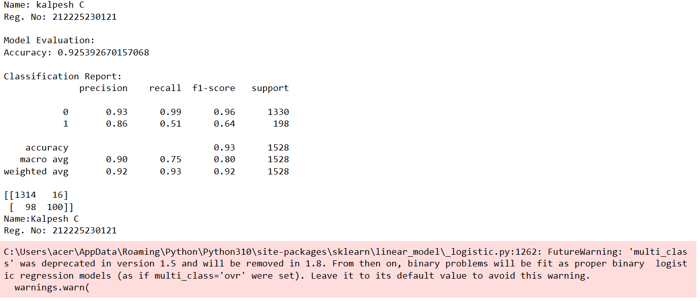

# BLENDED_LEARNING
# Implementation of Logistic Regression Model for Classifying Food Choices for Diabetic Patients

## AIM:
To implement a logistic regression model to classify food items for diabetic patients based on nutrition information.

## Equipments Required:
1. Hardware – PCs
2. Anaconda – Python 3.7 Installation / Jupyter notebook

## Algorithm
**Algorithm: SVM Classification with Hyperparameter Tuning**

1. Start
2. Import required libraries: pandas, matplotlib, seaborn, sklearn modules
3. Load the dataset from 'food_items_binary.csv' into a DataFrame
4. Display the first few rows and column names of the dataset
5. Select input features: Calories, Total Fat, Saturated Fat, Sugars, Dietary Fiber, Protein
6. Select target variable: class
7. Split the dataset into training and testing sets (70% training, 30% testing)
8. Apply StandardScaler to normalize the feature values
9. Initialize the Support Vector Machine (SVM) classifier
10. Define the parameter grid with values for C, kernel, and gamma
11. Apply GridSearchCV with 5-fold cross-validation to find the best parameters
12. Train the model using the training data
13. Retrieve the best model from GridSearchCV
14. Display the best parameters
15. Use the best model to predict the target values for the test data
16. Calculate the accuracy of the model
17. Display the accuracy score
18. Generate and display the classification report (precision, recall, F1-score)
19. Compute the confusion matrix
20. Visualize the confusion matrix using a heatmap
21. Stop


## Program:
```
import pandas as pd
from sklearn.model_selection import train_test_split
from sklearn.linear_model import LogisticRegression
from sklearn.preprocessing import LabelEncoder,MinMaxScaler
from sklearn.metrics import accuracy_score,precision_score,recall_score,f1_score,confusion_matrix,classification_report
import seaborn as sns
import matplotlib.pyplot as plt
df=pd.read_csv('food_items_binary.csv')
print('Name:Kalpesh C')
print('Reg.No: 212225230121')
print('Dataset Overview')
print(df.head())
print("\nDataset Info:")
print(df.info())
X_raw=df.iloc[:,:-1]
y_raw=df.iloc[:,-1:]
scaler=MinMaxScaler()
X=scaler.fit_transform(X_raw)
label_encoder=LabelEncoder()
y=label_encoder.fit_transform(y_raw.values.ravel())
X_train,X_test,y_train,y_test=train_test_split(X,y,test_size=0.2,stratify=y,random_state=123)
penalty='l2'
multi_class='multinomial'
solver='lbfgs'
max_iter=1000
l2_model=LogisticRegression(random_state=123,penalty=penalty,multi_class=multi_class,solver=solver,max_iter=max_iter)
l2_model.fit(X_train,y_train)
y_pred=l2_model.predict(X_test)
print('Name: kalpesh C')
print('Reg. No: 212225230121')
print("\nModel Evaluation:")
print("Accuracy:",accuracy_score(y_test,y_pred))
print("\nClassification Report:")
print(classification_report(y_test,y_pred))
conf_matrix=confusion_matrix(y_test,y_pred)
print(conf_matrix)
print("Name:Kalpesh C")
print("Reg. No: 212225230121")

```

## Output:





## Result:
Thus, the logistic regression model was successfully implemented to classify food items for diabetic patients based on nutritional information, and the model's performance was evaluated using various performance metrics such as accuracy, precision, and recall.
